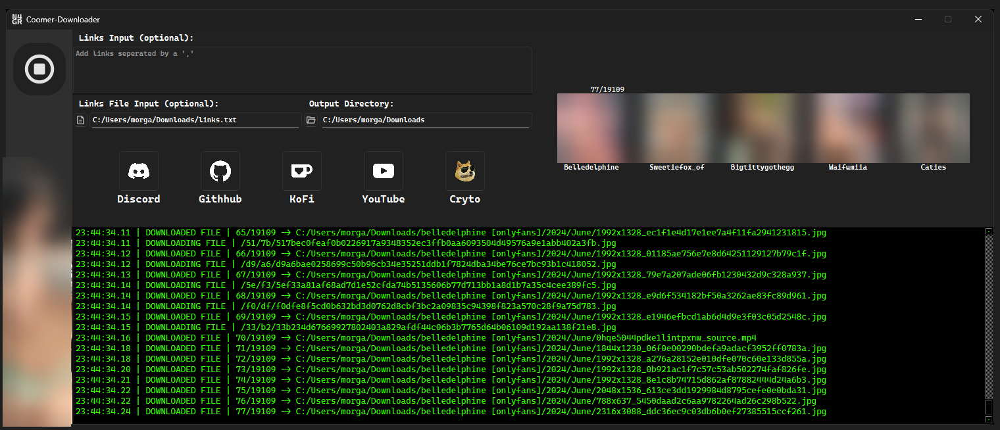

> [!NOTE]
> This is a third-party tool, not developed and produced by coomer.su or anyone assosciated with them.

# Coomer-Downloader
Coomer-Downloader is a multi-threaded downloading tool that utilises the coomer.su API to easily download multiple creators.

    

## Download / Install
The application is packaged in an .exe format for users on Windows x64 systems or a Linux executable for those on the penguin - they **SHOULD** work out of the box as everything is packaged with pyinstaller; but, for those that want to run the tool from the source files, it's fairly easy.

#### Easy / Recommended:
Download the tool with the latest version of your operating system from GitHub and run it, boom! Easy as pie. - [GitHub Releases](https://github.com/N4GR/Coomer-Downloader/releases/latest)

#### Python Source Install:
1. Download the source code of the main branch, following this link: [GitHub Source Code](https://github.com/N4GR/Coomer-Downloader/archive/refs/heads/main.zip) or by clicking code, followed by "Download Zip" at the top of this page.

2. With the source code installed, make sure you're running on the latest version of python (whether in a virtual enviroment or global); the app was made and tested using Python 3.13

3. Download the required python packages using `pip install package_name` replacing package_name with the required packages. As of version 2.0, the required packages are:
    + [PySide6](https://pypi.org/project/PySide6/) - To handle windowing.
    + [requests](https://pypi.org/project/requests/) - To handle downloads and API requests.
    + [PyYAML](https://pypi.org/project/PyYAML/) - To read and write to YAML config files.

4. Once the packages are installed, run the coomer-downloader.py application and everything will work just like that! **Enjoy**.

## Socials
Enjoy the program? There's a few ways you can help me out, whether that be by donating or just simply joining along for the ride - it's all appreciated as I'm just one guy trying to get by, here's a few links so you can follow / get updates on new releases or even just come for a chat.

    
    
    
    

